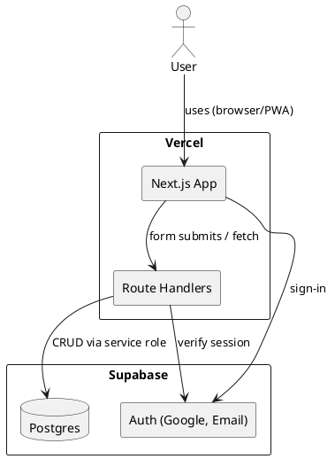
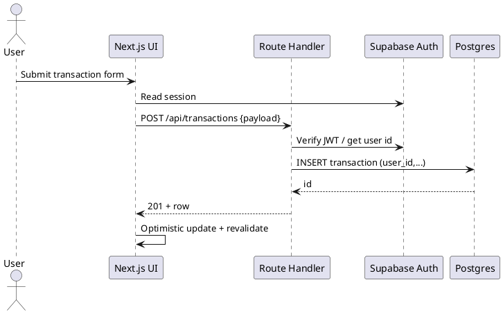

# SPEC-001-Budgeting Tool

## Background

A lightweight, privacy-friendly budgeting web app hosted on Vercel that lets individuals quickly log income and expenses via a single, dynamic form. Users can define custom categories, view simple charts of spending vs. income, and (later) receive monthly summaries of habits and totals. The experience should be mobile-first (responsive/PWA) and entirely free to run using services with generous free tiers.

## Requirements (initial capture)

- **Must**: Free to build/run using free-tier services; no paid dependencies.
- **Must**: Quick-entry form to log income/expense with date, amount, category, notes.
- **Must**: User-managed categories (create/edit/merge, basic icons/colors optional).
- **Must**: Visualizations for spend vs. income and category breakdowns.
- **Must**: Web + mobile friendly (responsive; PWA optional).
- **Should**: CSV import/export.
- **Should**: Basic filters (date range, category, amount, text search).
- **Won’t (for MVP)**: Offline-first/queueing; instead show an offline notice with guidance to contact support.
- **Later**: Monthly reports of spending/income trends (in-app and/or emailed PDF/CSV); offline mode can be revisited.

(Once you confirm Background/Requirements, I will propose the Method/Architecture.)

(Once you confirm Background/Requirements, I will propose the Method/Architecture.)


## Method (proposal)

### Tech Stack (free-tier friendly)
- **Frontend/Hosting**: Next.js (App Router) on Vercel free tier; responsive UI with Tailwind CSS; PWA basics (manifest + service worker) for offline entry.
- **Auth & Database**: Supabase free tier — Auth (Google OAuth + Email/Password) and Postgres DB.
- **API Layer**: Next.js Route Handlers (server actions) calling Supabase via service role on the server only.
- **ORM / Migrations**: **Drizzle ORM + drizzle-kit** (schema-as-code, typed queries, SQL migrations committed to repo).
- **Charts**: Chart.js with react-chartjs-2 for category breakdowns and income vs. expense trends.
- **Job/Reports**: Vercel Cron (free) to trigger monthly report generation endpoints.
- **File/Exports**: CSV export generated on the server; optional CSV import (client parses -> server validates -> batch insert).

### Core Features → Components
- **Quick Entry Form**: amount, type (income/expense), date, category (select or add new inline), notes; optional merchant/tag.
- **Category Manager**: list, create, edit, archive/merge; color/icon.
- **Dashboard**: KPIs (this month spend, income, net), charts (donut by category, line by day), recent transactions.
- **Transactions Table**: infinite scroll/pagination, filters (date range, category, min/max, text), edit/delete inline.
- **Reports**: monthly rollups + trend deltas; **email summary + PDF download**.

### Default Categories (seed on first login)
- **Expenses**: Rent, Groceries, Transport, Eating Out, Utilities, Tithing, Advance Campaign, Other
- **Income**: Salary, Other

### Data Model (Postgres) (Postgres)
```sql
-- users handled by supabase.auth.users (UUID). We'll mirror minimal profile in public schema
create table public.user_profile (
  user_id uuid primary key references auth.users(id) on delete cascade,
  created_at timestamptz not null default now(),
  display_name text,
  currency char(3) not null default 'USD',
  date_format text not null default 'MM/DD/YYYY'
);

create table public.category (
  id uuid primary key default gen_random_uuid(),
  user_id uuid not null references auth.users(id) on delete cascade,
  name text not null,
  type text not null check (type in ('expense','income','both')),
  color text,
  icon text,
  archived boolean not null default false,
  unique (user_id, lower(name))
);

create table public.transaction (
  id uuid primary key default gen_random_uuid(),
  user_id uuid not null references auth.users(id) on delete cascade,
  category_id uuid references public.category(id) on delete set null,
  amount numeric(12,2) not null check (amount >= 0),
  kind text not null check (kind in ('expense','income')),
  occurred_on date not null,
  note text,
  created_at timestamptz not null default now(),
  updated_at timestamptz
);
create index trx_user_date_idx on public.transaction(user_id, occurred_on desc);
create index trx_user_kind_idx on public.transaction(user_id, kind);
create index trx_user_category_idx on public.transaction(user_id, category_id);

-- optional tags
create table public.tag (
  id uuid primary key default gen_random_uuid(),
  user_id uuid not null references auth.users(id) on delete cascade,
  name text not null,
  unique (user_id, lower(name))
);
create table public.transaction_tag (
  transaction_id uuid references public.transaction(id) on delete cascade,
  tag_id uuid references public.tag(id) on delete cascade,
  primary key (transaction_id, tag_id)
);
```

### Row-Level Security (RLS)
- Enable RLS on all tables; policies to allow users to `select/insert/update/delete` rows where `user_id = auth.uid()`.
- Server-side admin operations (e.g., merges) via service role in protected route handlers.

### PlantUML – Component Overview


### Key Flows (sequence)


### Reporting Strategy
- Vercel Cron triggers `/api/reports/monthly?yyyymm=...` per user.
- Materialized views for fast rollups per user/month (e.g., totals by category, daily trend).
- PDF generation via **@react-pdf/renderer** (server-side in route handler) to avoid headless Chrome.
- **Email delivery** using **Resend** free tier (or SMTP if configured) sending a summary and secure link (magic link or authenticated download).

### Performance & Cost Notes
- Default **currency: USD**; **date format: MM/DD/YYYY**; report periods use **calendar month (1st–end)**.
- With ≤50 users and modest entries, Postgres + free tiers more than suffice.
- Use `numeric(12,2)` to avoid float issues; index by `(user_id, occurred_on)` for dashboard queries.
- Cache via Next.js (Segmented: static shell + ISR for charts; client revalidation on mutation).

- With ≤50 users and modest entries, Postgres + free tiers more than suffice.
- Use `numeric(12,2)` to avoid float issues; index by `(user_id, occurred_on)` for dashboard queries.
- Cache via Next.js (Segmented: static shell + ISR for charts; client revalidation on mutation).


## Design System (branding-ready)

- **Theme**: Simple, modern, light UI.
- **Palette (semantic tokens)**:
  - `--color-bg`: #FFFFFF (base), `--color-bg-alt`: #F7F7FB
  - `--color-fg`: #111827, `--color-fg-muted`: #6B7280
  - `--color-primary`: #6366F1 (primary-500), hover #4F46E5, surface #EEF2FF
  - `--color-secondary`: #22C55E (secondary-500), hover #16A34A, surface #ECFDF5
  - `--color-border`: #E5E7EB, `--color-danger`: #EF4444
- **Typography**: Inter (system fallback), sizes: xs–2xl; weights: 400/600.
- **Spacing & Radius**: 4/8/12 spacing scale; radius `xl` (12px) default; shadows soft.
- **Components**: Button (primary/secondary/ghost), Input, Select, Modal, Card, Tabs, ChartCard.
- **Icons**: lucide-react (free). Minimal use.
- **Accessibility**: 4.5:1 contrast for text; focus rings.

**Tailwind config excerpt**
```ts
// tailwind.config.ts (excerpt)
export default {
  theme: {
    extend: {
      colors: {
        primary: { DEFAULT: '#6366F1', 600: '#4F46E5', 50: '#EEF2FF' },
        secondary: { DEFAULT: '#22C55E', 600: '#16A34A', 50: '#ECFDF5' },
      },
      borderRadius: { xl: '12px' },
    }
  }
}
```

## Implementation

### Environment Variables (Vercel)
- `NEXT_PUBLIC_SUPABASE_URL`
- `NEXT_PUBLIC_SUPABASE_ANON_KEY`
- `SUPABASE_SERVICE_ROLE_KEY` (server only)
- `RESEND_API_KEY` (server only, optional until reports phase)

### API Contracts
- `GET /api/transactions?from=YYYY-MM-DD&to=YYYY-MM-DD&categoryId=&kind=&q=&limit=&cursor=` → `{ items:[Transaction], nextCursor }`
- `POST /api/transactions` body `{ amount:number, kind:'income'|'expense', occurredOn:'YYYY-MM-DD', categoryId?:uuid, note?:string }`
- `PATCH /api/transactions/:id` body `{ ...partial }`
- `DELETE /api/transactions/:id`
- `GET /api/categories` → list
- `POST /api/categories` body `{ name, type, color?, icon? }`
- `POST /api/categories/:id/merge` body `{ intoCategoryId }`
- `GET /api/reports/monthly?year=YYYY&month=MM` → `{ totals, byCategory, byDay, deltas }`
- `GET /api/reports/monthly.pdf?year=YYYY&month=MM` → `application/pdf`
- `POST /api/email/report` body `{ year, month }` → 202 Accepted

### Bootstrap
1. Create Next.js app (App Router), add Tailwind (with theme tokens), PWA manifest (no offline queueing for MVP).
2. Add Supabase JS; configure client and server helpers.
3. Add Drizzle + drizzle-kit; connect to Supabase Postgres.

### Database & Auth
- Apply schema and RLS (as earlier). Seed defaults on first login.

### Reports – SQL Aggregations & Materialized Views
```sql
-- 1) Daily totals (per user, per day)
create materialized view if not exists public.mv_daily_totals as
select
  t.user_id,
  t.occurred_on,
  sum(case when t.kind='income' then t.amount else 0 end) as income,
  sum(case when t.kind='expense' then t.amount else 0 end) as expense
from public.transaction t
group by t.user_id, t.occurred_on;
create index if not exists mv_daily_user_date_idx on public.mv_daily_totals(user_id, occurred_on);

-- 2) Monthly by category
create materialized view if not exists public.mv_month_category_totals as
select
  t.user_id,
  date_trunc('month', t.occurred_on)::date as month_start,
  coalesce(t.category_id, '00000000-0000-0000-0000-000000000000'::uuid) as category_id,
  sum(case when t.kind='income' then t.amount else 0 end) as income,
  sum(case when t.kind='expense' then t.amount else 0 end) as expense
from public.transaction t
group by t.user_id, month_start, category_id;
create index if not exists mv_mct_user_month_idx on public.mv_month_category_totals(user_id, month_start);

-- Helper function to refresh MVs
create or replace function public.refresh_reports_materialized_views(u uuid, y int, m int)
returns void language plpgsql as $$
begin
  refresh materialized view concurrently public.mv_daily_totals;
  refresh materialized view concurrently public.mv_month_category_totals;
end;$$;
```

### Example Report Query (server)
```sql
-- Inputs: $1 = user_id, $2 = month_start::date
with month_days as (
  select generate_series($2, ($2 + interval '1 month' - interval '1 day')::date, '1 day')::date as d
)
select
  d.d as day,
  coalesce(dt.income,0) as income,
  coalesce(dt.expense,0) as expense
from month_days d
left join mv_daily_totals dt on dt.user_id = $1 and dt.occurred_on = d.d
order by d.d;
```

### PDF Rendering (server route outline)
- Use `@react-pdf/renderer` component `<MonthlyReportPDF {...data} />` and stream response with `Content-Disposition: inline; filename=budget-YYYY-MM.pdf`.

### UI & Flows
- As specified earlier, with **USD** currency formatting and **MM/DD/YYYY** dates.

### Testing & QA
- As previously listed.

### Deploy
- As previously listed.


1) **Bootstrap**
   - Create Next.js app (App Router), add Tailwind, PWA manifest (no offline queueing for MVP).
   - Add Supabase JS client; set URL/anon key env vars; create service role key for server routes.
   - Add Drizzle (Postgres driver), configure `drizzle.config.ts` and migration folder.

2) **Database & Auth**
   - Run Drizzle migrations for `user_profile`, `category`, `transaction`, `tag`, `transaction_tag`.
   - Enable RLS on all tables (policies restricting by `auth.uid()`).
   - Configure Supabase Auth providers: Google + Email/Password. Redirect to `/dashboard` post-login.
   - **Seed default categories** on first login using a server route that checks if user has categories; if none, insert defaults (including *Tithing* and *Advance Campaign*).

3) **API Routes (Route Handlers)**
   - `/api/transactions` (GET with filters, POST create, PATCH/DELETE by id)
   - `/api/categories` (CRUD, merge endpoint)
   - `/api/reports/monthly` (GET for yyyymm, aggregates; returns JSON + optional PDF)
   - `/api/reports/monthly.pdf` (stream PDF)
   - `/api/email/report` (POST to send monthly email via Resend)

4) **UI**
   - **Auth pages**: sign-in/sign-up + protected layouts (middleware guards).
   - **Quick Entry Form**: inline new-category modal; optimistic updates.
   - **Dashboard**: KPIs, donut (spend by category), line chart (daily net), recent list.
   - **Transactions**: table with filters, infinite scroll, edit/delete.
   - **Categories**: CRUD, color/icon pickers, archive/merge.
   - **Reports**: month selector, summary cards, download PDF, "Email me this report" button.

5) **Reporting**
   - Create materialized views `month_user_totals` and `month_category_totals`.
   - Vercel Cron → call reports API monthly; pre-generate PDFs optionally and cache for quick download.
   - Integrate Resend (free-tier) for transactional emails; store minimal email log per user.

6) **Testing & QA**
   - Unit tests for API handlers; Playwright for core flows (add/edit/delete, charts render, PDF generation).
   - Seed script for demo data.

7) **Deploy**
   - Vercel project, env vars for Supabase & service role; Resend API key.
   - Set up Cron in Vercel dashboard.

## Milestones

- **M1 – Auth & DB (1–2 days)**: Supabase auth, Drizzle schema, RLS, seed defaults.
- **M2 – Entry + Categories (2–3 days)**: Quick form, category manager.
- **M3 – Dashboard & Charts (2 days)**: KPIs + donut/line charts.
- **M4 – Transactions & Filters (2 days)**: Table with edits, CSV export.
- **M5 – Reports (2–3 days)**: Monthly aggregates, PDF generation, email delivery, cron.
- **M6 – Polish (1–2 days)**: Accessibility pass, empty states, performance.

## Gathering Results

- Track: time-to-first-entry (<30s), D1/D7 retention, monthly savings trend.
- In-app feedback: thumbs-up/down on charts & reports; optional NPS prompt quarterly.

## AI Roadmap (later)

- **Phase A – Smart Categorization**: rule engine + heuristics, then optional light ML (Naive Bayes) trained per user to auto-suggest categories based on note/merchant/amount.
- **Phase B – Budget Planner**: goal setting (per-category caps), envelope suggestions, alerts when trending to overspend.
- **Phase C – Insights Assistant**: LLM-generated summaries on monthly reports ("You spent 18% less on Eating Out vs September"), with actionable tips. Start with client-side templated insights (no API cost), then consider a hosted LLM for natural-language.
- **Privacy/Cost**: keep PII minimal; opt-in for any external AI APIs; cache prompts; provide export/delete.

## Need Professional Help in Developing Your Architecture?

Please contact me at sammuti.com :)
